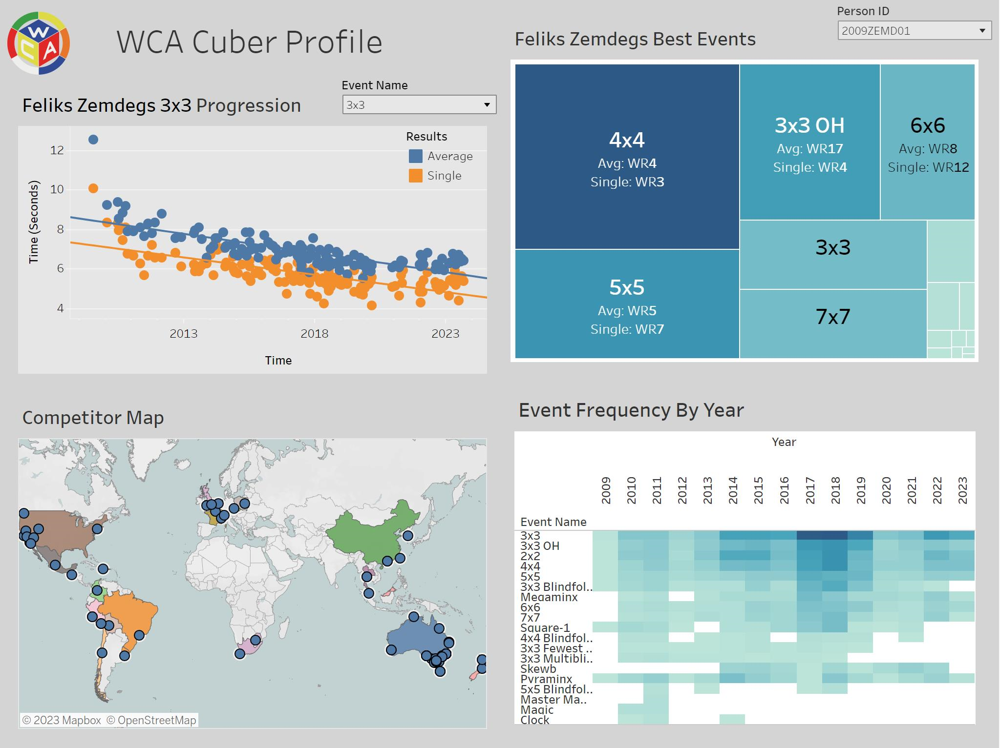

# SQL + Tableau WCA Profile Dashboard

## Description:
The WCA Profile Dashboard is a data science project that combines SQL data extraction with Tableau visualization to provide a comprehensive view of speedcubing competition data for the top 1500 3x3 solvers. The project leverages SQL data extraction to provide relevant information and uses Tableau's powerful visualization capabilities to make the data accessible and interactive. It's designed to offer valuable insights for speedcubing enthusiasts and competitors, enabling them to explore performance trends, competition locations, and more. The data source used is the World Cube Association's official competition results exported from https://www.worldcubeassociation.org/export/results on September 29, 2023. 

You can explore the dashboard [HERE](https://public.tableau.com/shared/5YHFC529X?:display_count=n&:origin=viz_share_link).

## Key Features:

### SQL Data Extraction: 
The project involves SQL queries to extract and transform data from the WCA results database export using MySQL.

### Tableau Dashboard: 
The core of the project is a Tableau dashboard that allows users to interact with the data visually. The dashboard offers a user-friendly interface with dropdown functionality for selecting specific cubers or filtering by events.

### Tableau Visualizations:
- Scatterplot of Cuber Time Trends: The scatterplot displays the time trends of selected events over time, showing how their performance in various events has evolved.
- Heatmap of Event Frequency by Year: A heatmap visualizes the frequency of events competed in by year, helping users identify competitor trends and event preferences.
- World Map of Competition Locations: The map view pinpoints the locations of WCA competitions worldwide, providing a geographic perspective on cubing events and letting competitors .
- Tree Map for Best Events: The tree map illustrates a cuber's best events based on their world ranking, giving insights into their areas of expertise.
  
### Limitations
- Due to file size limitations in Tableau, the dashboard is limited to the top 1500 3x3 solvers. 

